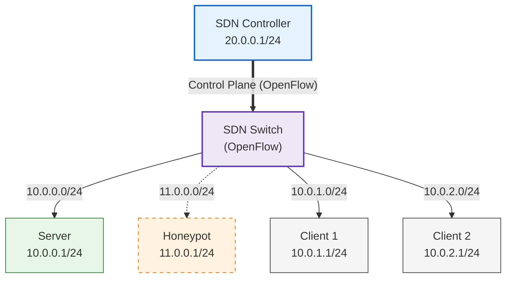

# SDN-Based Honeypot

This project was developed as part of the _"Next Generation Network"_ course. It implements a **security honeypot** architecture based on **Software-Defined Networking (SDN)** over a Kathará-emulated enterprise network.

The scenario model a company environment composed of:
- A legitimate **server** exposing HTTP services
- A **honeypot** that mimics the server
- Two **hosts** representing both authorized and unauthorized users

The SDN controller dynamically **identifies untrusted access attempts** and, instead of blocking the source IP, leverages SDN capabilities to **redirect** the malicious hosts to the honeypot.
Thanks to packet manipulation at the network layer, the malicious host remains **unaware** of the redirection.

---

## Project description
The project consists of an active laboratory environment in which the network of a fictitious company, called _HoneyMoon INC_, is deployed using Kathará. Clients can interact with the infrastructure by accessing services hosted within the network.
The architecture follows a **client–server** model, with traffic fully managed by an SDN-enabled switch under the control of a centralized controller.

### Network Topology

The network is composed of five hosts, each belonging to a different subnet, interconnected through an Open vSwitch and managed by an SDN controller (`Ryu`). The network topology is shown following schema:



### Trust Model

The entire project is based on the concept that not all the subnets in the company have the same privileges:
- **Trusted subnet**: `10.0.1.0/24` --> `Client 1`
- **Untrusted subnet**: `10.0.2.0/24` --> `Client 2`

The server exposes an HTTP service that includes an admin-only area containing private information.
Hosts belonging to trusted networks are allowed to access such resources, whereas traffic originating from untrusted networks is closely monitored.

### SDN Control Logic

All packets flow through the SDN switch which operates under the control of the `Ryu` controller, acting as the **logical brain** of the network. The controller
1. Handles **incoming packets** (`PACKET-IN`) according to SDN principles
2. Implements **routing functions** for inter-network communication
3. Installs **flow rules** on the switch using `FLOW_MOD` messages for subsequent packets.

The controller follows a **self-learning** approach: it is initially aware only of the involved subnets (defined in `NETCONFIG.py` file) while output ports and IP-to-MAC associations are dynamically learned during operation.

### HoneyPot implementation

The honeypot is deployed as a separate host within the network and runs a service that closely **replicates the behavior of the legitimate server**, while providing **fake and non-sensitive information**. Its purpose is to deceive malicious users by offering an environment that appears genuine, thereby allowing their activity to be observed without exposing real assets.

Once the SDN controller has learned the network topology, it continuously **monitors traffic** originating from untrusted subnets. When packets contain application-layer payloads, the controller performs **Deep Packet Inspection (DPI)** to detect attempts to access protected resources.

Upon identifying a suspicious or unauthorized access attempt, the controller exploits SDN capabilities to **redirect the traffic toward the honeypot**.

This redirection is achieved by installing flow rules on the switch that dynamically modifying packet's **L3-headers**, ensuring that the malicious client remains **unaware of the redirection**. From the attacker’s perspective the communication is established with the server, while in reality it is being handled by the honeypot. This approach allows the system to both protect the legitimate server and **gather valuable information** about malicious behavior.

---

## Repository Structure

This repository is organized as follows:

```bash
main
├── build.sh
├── Dockerfiles
│   ├── Dockerfile.host
│   ├── Dockerfile.ryu
│   └── Dockerfile.server
├── Kathara
│   ├── controller.shutdown
│   ├── controller.startup
│   ├── h1.startup
│   ├── h2.startup
│   ├── honeypot.startup
│   ├── lab.conf
│   ├── s1.startup
│   ├── server.startup
│   └── shared
│       ├── controllerSDN
│       │   ├── controller.py
│       │   ├── customLogger.py
│       │   └── NETCONFIG.py      
│       └── scripts
│           └── init.sh
├── LICENSE
├── README.md
└── Services
    ├── HttpController
    │   ├── app.py
    │   ├── static
    │   └── templates
    ├── HttpHpot
    │   ├── app.py
    │   └── templates
    └── HttpServer
        ├── app.py
        └── templates
```

- `/Dockerfiles`: contains the container images for the controller, servers, and hosts
- `/Kathara`: contains the Kathará configuration files and the shared scripts
- `/Kathara/shared/`: contains the `init.sh` script for device initialization and the Python code for the Ryu controller
- `/Services`: contains the HTTP services deployed on each virtual machine

---

## Usage

### Requirements

The project requires **Kathará** (and consequently **Docker**) for deployment.
Please refer to the following [link](https://www.kathara.org/download.html) to access the Kathará download page and follow the installation and configuration instructions.

Although Kathará is designed to work on multiple operating systems, this project has been **tested on a Linux-based distribution**. For this reason, the instructions provided below refer to a Linux environment, which is therefore **recommended**.

### Project setup

1. Clone the repository and navigate to the project directory:
```bash
git clone https://github.com/Ale-Deto04/SDN-based_honeypot.git
cd SDN-based_honeypot/
```

2. Run the build.sh script to build the Docker images used in the lab. The script automatically downloads all required dependencies and installs the HTTP service scripts inside the containers.
```bash
./build.sh
```

### Project startup

Navigate to the `Kathara` folder and start the lab.
```bash
cd Kathara/
kathara lstart
```

Kathara will automatically deploy the virtual machines, opening **three terminal windows**: one for Client1 (`h1`), one for Client2 (`h2`) and one for the Honeypoy. The remaining terminals (controller, switch and server) are **not required for this project**.

> [!WARNING]
> Each terminal should display a startup message.
> ```bash
> Waiting startup commands execution. Press [ENTER] to override...
> ```
>
> **DO NOT** override - this behaviour is completely normal as the virtual machines are watingn for the controller to start. You can proceed with the next steps.


> [!TIP]
> By default, Kathará uses **xterm** as the terminal emulator. It is highly suggested to switch to a more comfortable alternative. To launch Kathará with a custom terminal emulator, use the `--terminal-emu` flag followed by the path to the desired terminal, for example:
> ```bash
> kathara lstart --terminal-emu /usr/bin/gnome-terminal
> ```

---

## The Lab

### Controller Dashboard

Open your browser and navigate to the `controller` dashboard by typing the URL `http://localhost:8080/dashboard`. The web app for the controller should appear. From here, you can navigate through the three sections:

1. **Home**: displays the status of the server and the honeypot
2. **Console**: replicates to the controller terminal window
3. **Devices**: shows the devices currently connected to the switch

At first, the dashboard may appear mostly empty. This is because the SDN controller is not running yet.  
Go to the **Home** page and click the green **Launch Controller** button.

Once the controller starts, the **Console** and **Devices** sections will begin to populate, and the status on the **Home** page will switch to **ON**.  
Wait until all the virtual machines are fully initialized.

> [!WARNING]
> **DO NOT** proceed until every Kathará terminal no longer shows the startup message and instead displays:
> ```bash
> [INFO]: system ready
> ```
> 
> This process may take a few seconds.

Once everything has started, you can notice some **initial network traffic** on the controller's **Console** page. This traffic is generated by the `init.sh` script, which is executed by each virtual machine to **speed up the controller's self-learning process**.

In this script, each machine pings the switch to generate **packet-in events**, allowing the controller to learn information about the network, including IP addresses and which devices are authorized or unauthorized.

On the **Devices** page, you should see all **devices detected** by the controller, along with their **trust status** (trusted or untrusted).

Note that the switch provides **virtual IPs** that act as **gateways** for the VMs. These IPs are managed by the controller and do not correspond to actual physical addresses.


### Clients

The clients are able to communicate across the network with the server. To test this, open a client terminal and **ping the server** by typing:
```bash
ping -c 1 10.0.0.1
```

Alternatively, you can use the **local DNS record**:
```bash
ping -c 1 honeymoon.com
```

Both clients should be able to reach the server and receive a response.

Each client is also equipped with `w3m` **CLI web browser**, which allows users to navigate web services directly from the terminal

On `h1`, visit the server's web service by typing:
```bash
w3m http://honeymoon.com/
```

You should be redirected to the **server's home page**. You can navigate using the arrow keys or the mouse, and press `ENTER` to follow links.

For simplicity, the web service is minimal, providing an About page and a login form for the admin dashboard.

Navigate to login page and submit the credentials `admin:admin`. Since Client 1 belongs to a **trusted subnet**, it can succesfully **access the sensitive informations**.


### Threat detection

On `h2` perform the same steps of Client 1. You can visit the web server as Client 1.

When you try to login 

---

## Technologies involved

1. Kathará (Docker) for network emulation
2. Ryu for the SDN Controller
3. Flask and SocketIO for HTTP Services
